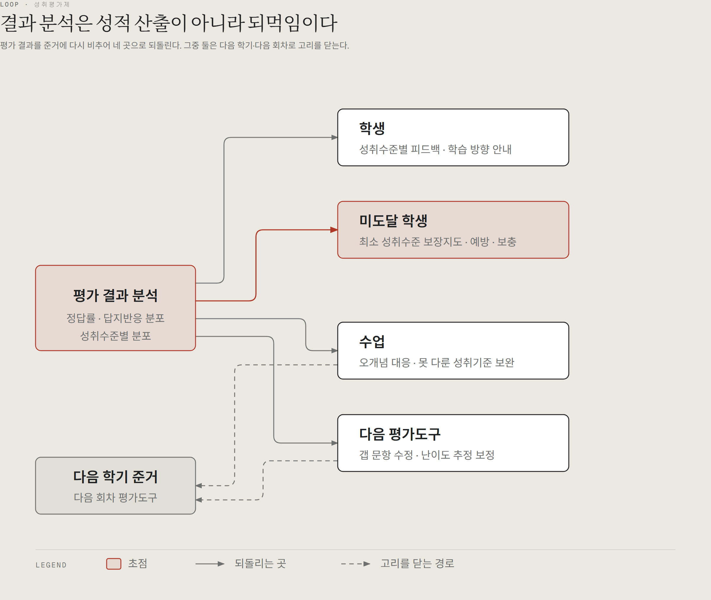
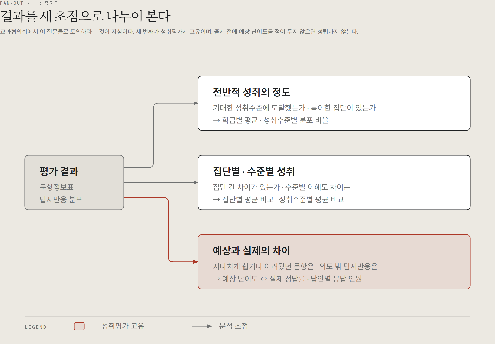
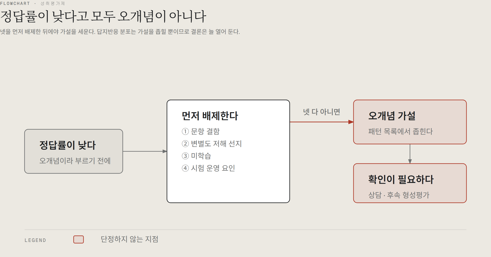
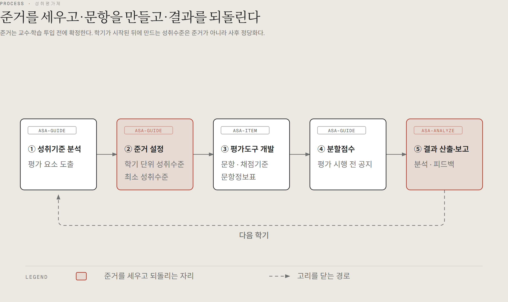

# 다이어그램

성취평가제의 핵심 구조 네 가지를 그림으로 정리했습니다.

각 다이어그램은 **자체 포함 HTML + SVG**입니다. `.html` 파일을 브라우저에서 바로 열면 되고,
빌드 단계나 외부 의존성이 없습니다. GitHub에서 미리 보시라고 `.png` 도 함께 두었습니다.

만든 방식은 [diagram-design](https://github.com/cathrynlavery/diagram-design)의 설계 규칙을 따랐고,
색은 저장소 배너에서 뽑았습니다 — `paper #ece9e2` · `ink #1e2022` · `accent #ad3827` · `muted #6f7171`.

---

## ① 되먹임 구조



**결과 분석은 성적 산출이 아니라 되먹임입니다.** 상대평가에서는 "누가 몇 등인가"로 끝나지만,
성취평가제에서는 결과를 준거에 다시 비추어 네 곳으로 되돌립니다.

가장 잘 빠지는 것이 **다음 평가도구**입니다. 예상 난이도와 실제 정답률을 맞춰 보는 연습을 누적하는 것이
성취수준–문항 연계 전문성을 키우는 사실상 유일한 방법이고, 그 기록이 쌓여야 다음 학기 추정분할점수가 정확해집니다.

→ [`01-feedback-loop.html`](01-feedback-loop.html)

---

## ② 3-Focus 분석 틀



교과협의회에서 **이 질문들로 토의하라**는 것이 지침입니다.

세 번째가 성취평가제 고유입니다. 그리고 **출제 전에 예상 난이도를 적어 두지 않으면 이 초점 자체가 성립하지 않습니다.**
`asa-item` 이 문항정보표에 예상 난이도를 반드시 기록하게 하는 이유입니다.

→ [`02-three-focus.html`](02-three-focus.html)

---

## ③ 오개념 배제 절차



**정답률이 낮다고 모두 오개념이 아닙니다.** 넷을 먼저 배제한 뒤에야 가설을 세웁니다.

답지반응 분포는 가설을 좁힐 뿐 확정하지 못하므로 결론은 늘 **"상담이나 후속 형성평가로 확인 필요"** 로 열어 둡니다.

> 시연에서 실제로 걸렸습니다. 어느 문항의 오답 쏠림이 오개념이 아니라 **부정 발문 오독**이었습니다.

→ [`03-misconception-gate.html`](03-misconception-gate.html)

---

## ④ 5단계 절차와 세 스킬



**준거는 교수·학습 투입 전에 확정합니다.** 학기가 시작된 뒤에 만드는 성취수준은 준거가 아니라 사후 정당화입니다.

`asa-guide` 가 1·2·4단계, `asa-item` 이 3단계, `asa-analyze` 가 5단계를 맡습니다.

→ [`04-five-stage-chain.html`](04-five-stage-chain.html)

---

## 고쳐 쓰시려면

`.html` 파일을 열어 SVG를 직접 수정하시면 됩니다. 지켜야 할 규칙 몇 가지만 적어 둡니다.

| | |
|---|---|
| 4px 격자 | 좌표·크기·글자 크기 전부 4의 배수 |
| 직각 연결선 | 대각선 금지. 꺾이는 곳은 `r=8` 사분원 |
| 한글 최소 12px | 그 아래로는 뭉갭니다. 안 들어가면 글자를 줄이지 말고 **말을 줄입니다** |
| accent 최대 2개 | 셋 이상에 쓰면 초점 신호가 사라집니다 |
| 범례는 아래 띠로 | 그림 안에 띄우지 않습니다 |

고친 뒤 검사합니다.

```bash
python .work/diagram-design/skills/diagram-design/scripts/self_check.py docs/diagrams/*.html
```
